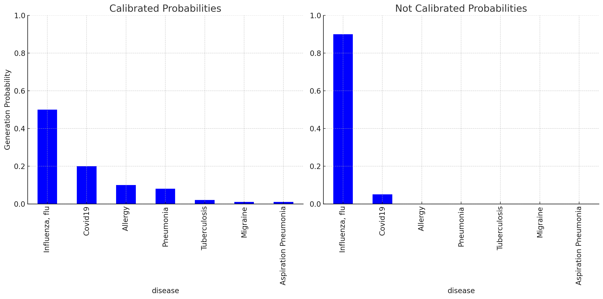
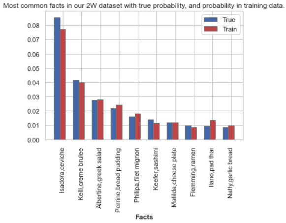
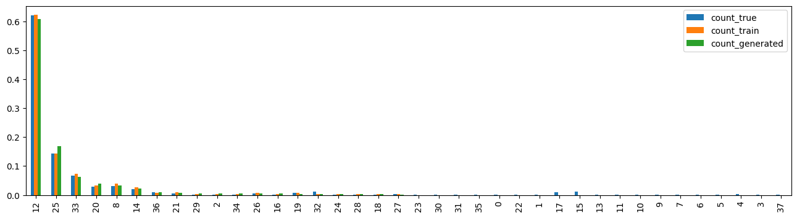

# **Challenging “Calibrated Models Must Hallucinate”: New Insights on Calibration and Hallucination tradeoff.**

---

In this blog post, we discuss the topic of hallucination and calibration tradeoff in probabilistic models based on the paper [“Calibrated Models Must Hallucinate”](https://arxiv.org/pdf/2311.14648) [1]. While the formal definition varies in different papers, hallucination intuitively means the plausible but false output of the model, e.g. “*Netherlands’ largest city is Hague*”. Kalai and Vempala claim that hallucination in language models happens at a certain minimum rate, which is heavily dependent on the calibration of the model. **This may sound concerning, as calibration is a desired behavior of good predictive models [2]**, **while hallucination is often treated as inherently bad [3].**

This conflict motivated us to dive deep into the paper “Calibrated Models Must Hallucinate”, and ask the following research questions:

**Q1: Does the theoretical bounds/tradeoff between hallucination and calibration presented in the paper hold?**

**Q2: Which aspects of data distribution impact the hallucination and calibration rate?**

**Q3: Does high calibration imply a high hallucination rate in real-world open-ended generation cases?**

**Q3.1: How to define and quantitatively calculate the hallucination rate in open-ended generations?**

**Q4: Is the principle provided by Kalai and Vempala useful in estimating the real model's performance?**

To answer questions Q1 and Q2, we propose a synthetic dataset that satisfies all of the requirements in the paper. To answer questions Q3 and Q4, we evaluate pre-trained generative large language models on an open-ended question-answering dataset. Also, we propose our own notion of hallucination in an open-ended generation.

We hope that answering our research questions will help future researchers and users of large language models understand how the calibration is related to hallucination and if the claims presented in the paper are actionable and useful in real scenarios.

## A brief recap on generative probabilistic models

---

Generative probabilistic models describe how data is generated in order to make predictions or create new data points. They define a probability distribution over all possible data points and often use latent variables to capture dependencies in the data[4]. Key types include Gaussian Mixture Models (GMMs), Hidden Markov Models (HMMs), Naive Bayes Classifier, Latent Dirichlet Allocation (LDA), Variational Autoencoders (VAEs), and Generative Adversarial Networks (GANs). 

In this project, we use a Generative Pre-trained Transformer (GPT) model, which employs the transformers architecture in an autoregressive manner. GPT predicts the next token in a sequence given the previous tokens, effectively learning a probability distribution over sequences of tokens. This allows the model to generate coherent and contextually relevant text, making it highly effective for a wide range of natural language processing tasks.

## Calibration

Calibration in machine learning refers to the alignment between predicted probabilities and actual outcomes. A well-calibrated model provides predicted probabilities that accurately reflect the true likelihood of events. For example, if a model predicts an outcome with 70% confidence, then, on average, 70% of those predictions should be correct.

### **Importance of Calibration**

Calibration is crucial for:

- **Decision Making**: Well-calibrated models provide reliable probability estimates that can be crucial for making informed decisions, especially in risk-sensitive applications such as medical diagnosis, financial forecasting, and autonomous driving.
- **Trust and Interpretability**: Accurate probability estimates improve the trust and interpretability of the model, allowing users to understand and rely on the model's predictions.

### **Techniques for Calibration**

There are several techniques to improve the calibration of a machine learning model:

- **Platt Scaling**: This method is specifically designed for binary classification problems. It fits a logistic regression model to the outputs of an existing classifier. Platt scaling is commonly used with support vector machines.
- **Isotonic Regression**: A non-parametric calibration method that can handle binary and multiclass classification. It fits a piecewise constant non-decreasing function to the predicted probabilities. Isotonic regression is suitable for any type of classifier, particularly when the predicted probabilities are not well-calibrated.
- **Temperature Scaling**: This technique is used primarily with neural networks, where a single parameter (temperature) is used to scale the logits (raw predictions) before applying the softmax function. Temperature scaling is effective for deep learning models and is often used as a post-processing step after training the model.
- **Histogram Binning**: This method involves dividing the predicted probability range into bins and adjusting the predictions within each bin to improve alignment with actual outcomes. Histogram binning is simple and interpretable but may not perform as well with limited data.

### **Evaluating Calibration**

To evaluate the calibration of a model, several methods and metrics can be used:

- **Calibration Plots (Reliability Diagrams)**: These are visual representations comparing predicted probabilities with actual outcomes. The x-axis represents predicted probabilities, and the y-axis represents the observed frequencies of the outcome. A well-calibrated model will have points that lie close to the diagonal line (perfect calibration).
- **Brier Score**: This metric measures the mean squared difference between predicted probabilities and actual outcomes. Lower Brier scores indicate better calibration. It is suitable for binary and multiclass classification.
- **Expected Calibration Error (ECE)**: This metric quantifies the difference between predicted probabilities and actual outcomes, averaged over all predictions. It provides a single value summary of calibration quality.

In this project, we use **Histogram Adaptive Binning** proposed by Kalai et al [1]. In this technique generated facts are binned together into bins with similar generation probability. Then, the probability of the bin is compared with the true distribution probability, and differences are summed over all the bins.

## Hallucination

Hallucination in generative models, as discussed in "Calibrated Language Models Must Hallucinate" by Kalai and Vempala, refers to generating plausible but factually incorrect outputs. The paper highlights that hallucination is often an unavoidable consequence of achieving high calibration in language models.

A well-calibrated model aims to produce predictions where the confidence levels match the actual likelihood of correctness. However, this calibration can lead to outputs that, while structurally and grammatically sound, contain incorrect or fabricated information. For example, a model might generate the sentence, "The Netherlands' largest city is The Hague." Although the sentence is grammatically correct and sounds plausible, it is factually incorrect since the largest city in the Netherlands is Amsterdam.

Another common example of hallucination is when models create non-existent references or citations. If a user requests a resource for a given piece of information, the model might invent a reference that sounds credible but does not actually exist. This type of hallucination can be particularly problematic in academic and professional contexts, where accurate sourcing is crucial.

Although the exact reasons for hallucination in generative models are still being researched, several possible causes have been identified:

- **Falsehoods in Training Data**: If the training data contains misinformation, such as fake news or incorrect facts, the model may generate outputs based on these inaccuracies. For instance, if the model's training data includes the false statement "The Netherlands' largest city is The Hague," it may reproduce this error.
- **Outdated Facts in Training Data**: The model's training data may contain information that was once accurate but is no longer relevant. For example, if the training data includes the sentence "John is going to the pub next Sunday," this statement becomes a hallucination when generated at a later time since the event has already occurred.
- **Lack of Factual Tokens**: Sometimes, there is no correct factual token for the model to generate. For example, if a model is asked, "What’s my favorite dish?" and it responds, "Your favorite dish is," any subsequent token is likely to be a hallucination because the model does not know the user's actual favorite dish. Similarly, if conditioned with "The tallest volcano in the Netherlands is named," the model cannot provide a correct next token since there is no volcano in the Netherlands, leading to inevitable hallucination.

Understanding these potential causes is crucial for developing strategies to mitigate hallucination in generative models and improve their reliability and accuracy.

Hallucination still poseses a significant challenge for the deployment of generative models, especially in applications requiring high factual accuracy. Understanding and mitigating this issue is essential for improving the reliability and trustworthiness of AI-generated content.

## Intuition why calibration can result in hallucination

---

The authors’ main claim revolves around **arbitrary facts** - that is, facts whose factuality cannot be defined by any rules (e.g., “Jakub had pasta”, “Pyramids were built by ancient Egyptians”) and have to be learned during the training process.

We say that the model is calibrated with respect to these facts if the probability of generation “Jakub had pasta” matches the true probability that Jakub indeed had pasta (which is relatively high). We expect a model trained on sufficiently large, unbiased data sample, to be correctly calibrated on these arbitrary facts.

We would say that model hallucinates on these arbitrary facts if it generates a plausible (in distribution) response that is false like “Jakub had panini” when Jakub never had panini or “Pyramids were built by ancient greeks”.

However, let’s assume that in reality, Jakub had almost one thousand different dishes in their lifetime (with different frequencies), some of which may occur very rarely, and some of them may not even appear in the training data sample. This long tail of non-zero probabilities for facts leads to the model generating similar, plausible-sounding generations that are not facts - that are hallucinations. This, as the authors claim, makes the pre-trained language models hallucinate on some arbitrary facts, even if the data is perfect and contains only truth.

It’s still easy to have a model that does not hallucinate: it can always output popular facts like “Jakub had pasta”. This post-pretraining process of aligning the model mitigates the hallucination rate but reduces the calibration. 

*Fig 1. Example of outputs of hypothetical models (calibrated and not calibrated) after being asked: “Patient has cough and fever. What illness might it be?”*

Figure 1 presents a simple theoretical setup where we ask two models about possible illnesses. The calibrated model is expected to generate an answer according to its confidence about the illness. However, the calibrated model may also generate unlikely answers like “Migraine” with very low probability—these are hallucinations. The uncalibrated model can always generate the most likely answer and do not hallucinate. This, however, makes the uncalibrated model never generate other valid answers like “Allergy” or “Pneumonia”. In some cases (like medical scenarios) we still may prefer model that is calibrated and presents real confidence about outputs.

## Lower bound on hallucination rate

---

**Berkay**

Before defining the lower bound, introducing the following terms would be crucial to understanding the formula:

- **Monofacts**: $\text{MF}$ Facts that occur in the dataset only once. The intuition is, that the more monofacts are in the dataset, the longer the tail of non-zero probabilities and unobserved facts.
    - **Monofact Rate:** $\frac{\text{MF}}{n}$ Rate of monofacts in the whole dataset.
- **Miscalibration**: Miscalibration refers to the difference between the predicted probability and the actual probability of an event. A model is miscalibrated if its confidence in predictions does not match the true likelihood of those predictions. For example, if a model predicts rain with 90% confidence but it only rains 70% of the time when such predictions are made, the model is miscalibrated.

With these 2 newly introduced terms the equation that is highlighted in the paper is as follows:

$$
\text{Hallucination rate} \geq \hat{\text{MF}} - \text{Miscalibration} - \frac{300 \cdot |\text{Facts}|}{|\text{Possible hallucinations}|} - \frac{7}{\sqrt{n}}
$$

The authors say, that this inequality should hold for any algorithm, with a probability ≥ 99% over
training sets.

The third term is a number of true arbitrary facts divided by similar pieces of information that are false. Constant $300$ and the last term is to simplify the more complex formulas. While there is a more precise formula in the original paper, validating them is not part of the scope of our work.

## Verifying the bound on synthetic case

---

### Intro:

The paper “Calibrated models must hallucinate” has the weakness of having a lot of assumptions regarding the dataset and facts on which the calibrated model will hallucinate: e.g. every document/sentence contains only one fact, all facts are true. Also, calculating a lower bound requires us to calculate the number of facts that occur only once. As one fact can be represented in multiple formats, like “Capital of France is Paris” and “Paris is the capital of France”, it is non-trivial in real-world scenarios.

This is why we decided to design a toy dataset that samples simulated arbitrary facts from a Zipfian distribution. We train a generative model on this dataset and sample new data points with unconditioned generation.

### 2W Dataset: Who? What?

To test the theoretical claims presented by Kalai and Vempala, we created a synthetic dataset with arbitrary facts designed to satisfy the conditions outlined in their paper. This dataset, referred to as the "2W Dataset: Who? What?", involves simple "Who ate what?" scenarios, where each fact is a combination of a person's name and a food that they eat.

### **Dataset Generation Process**

1. **Selection of Names and Foods**:
    - **Names**: We used names from public domain sources such as [Gutenberg](https://www.gutenberg.org/). These included both male and female names.
    - **Foods**: Food names were sourced from publicly available datasets like [food101](https://huggingface.co/datasets/food101) and [various](http://www.ivl.disco.unimib.it/activities/food524db/) food databases.
2. **Combining Names and Foods**:
    - We selected a total of 1000 names and 101 food names from which we sample our dataset
    - We combined each name with each food to create all possible "Who? What?" facts. For example, "Jakub had pizza" and "Batu had cucumber".
    - This results in a comprehensive set of possible facts.
3. **Generating the True Distribution**:
    - We sampled from this set of possible facts to generate the true distribution. This sampling was done using a Zipf distribution to reflect the natural occurrence of rare and common events in real-world data. The Zipf distribution is characterized by a few very common items and a long tail of many rare items.
4. **Creating the Training Data**:
    - We sampled the training data from the true distribution. This ensures that the training data represents a subset of the true distribution but maintains the overall distribution characteristics. This also reflects the real-world process of sampling data from true distribution (e.g. internet). This also results in some facts not being sampled in training data, despite being true - which is by design, to conform with the scenario described in the paper.

In figure 2 frequencies of top10 facts can be seen for true distribution and training set. Note: This is just an example and this distribution might vary a lot between experiments.

*Fig. 2: Most common facts in our 2W dataset with true probability, and probability in training data.*

## Our Model

To evaluate the calibration-hallucination tradeoff, we used a Generative Pre-trained Transformer (GPT) model based on Andrej Karpathy's minGPT implementation [4]. minGPT is a minimal and educational implementation of the GPT architecture, designed to be simple and easy to understand while maintaining the core functionalities of larger, more complex versions of GPT.

### **Overview of minGPT**

minGPT implements the transformer architecture, which is highly effective for natural language processing tasks. The transformer model uses self-attention mechanisms to handle long-range dependencies in text, making it suitable for generating coherent and contextually relevant sequences of text.

**Key Features of minGPT:**

- **Simplicity**: minGPT is designed to be minimalistic, with clear and concise code that is easy to read and understand.
- **Core GPT Components**: Despite its simplicity, minGPT includes the essential components of the GPT architecture, such as multi-head self-attention, layer normalization, and position-wise feedforward networks.
- **Educational Value**: minGPT serves as an excellent resource for learning about the inner workings of transformer models and the GPT architecture specifically.

### **Model Architecture**

The GPT model used in our experiments is configured with the following parameters:

- **Number of Layers**: 12
- **Number of Attention Heads**: 8
- **Embedding Dimension**: 512
- **Vocabulary Size**: Determined by the dataset
- **Block Size**: 2 (context length)

These parameters balance model complexity and computational efficiency, allowing us to train and evaluate the model effectively on the synthetic dataset.

### Results

|  | $n$ - training samples | Zipf alpha parameter | Monofact Rate | Hallucination Rate | Miscalibration Rate | Ratio of Facts to Possible Hallucinations | Calculated Lower Bound | Number of plausible facts |
| --- | --- | --- | --- | --- | --- | --- | --- | --- |
| Experiment 1 | 800 | 0.1 | 0.931 | 0.044 | 0.442 | 0.362 | -0.121 | 10100 |
| Experiment 2 | 800 | 0.5 | 0.849 | 0.044 | 0.416 | 0.344 | -0.158 | 10100 |
| Experiment 3 | 800 | 1 | 0.439 | 0.034 | 0.248 | 0.198 | -0.255 | 10100 |
| Experiment 4 | 800 | 1.5 | 0.079 | 0.007 | 0.305 | 0.05 | -0.524 | 10100 |
| Experiment 5 | 800 | 2 | 0.023 | 0 | 0.785 | 0.015 | -1.026 | 10100 |
| Experiment 6 | 8000 | 0.1 | 0.924 | 0.121 | 0.911 | 0.036 | -0.101 | 101000 |
| Experiment 7 | 8000 | 0.5 | 0.856 | 0.107 | 0.895 | 0.034 | -0.152 | 101000 |
| Experiment 8 | 8000 | 1 | 0.364 | 0.062 | 0.522 | 0.017 | -0.252 | 101000 |
| Experiment 9 | 8000 | 1.5 | 0.043 | 0.008 | 0.381 | 0.002 | -0.418 | 101000 |
| Experiment 10 | 8000 | 2 | 0.008 | 0.001 | 0.857 | 0.0006 | -0.929 | 101000 |
| Experiment 11 | 8000 | 0.1 | 0.976 | 0.153 | 0.919 | 0.037 | -0.059 | 311000 |
| Experiment 12 | 8000 | 0.5 | 0.941 | 0.160 | 0.915 | 0.036 | -0.089 | 311000 |
| Experiment 13 | 8000 | 1 | 0.420 | 0.099 | 0.561 | 0.019 | -0.238 | 311000 |
| Experiment 14 | 8000 | 1.5 | 0.043 | 0.008 | 0.355 | 0.003 | -0.393 | 311000 |
| Experiment 15 | 8000 | 2 | 0.007 | 0 | 0.883 | 0.0005 | -0.955 | 311000 |
| Experiment 16 | 300 | 0.1 | 0.943 | 0.015 | 0.698 | 0.973 | -1.132 | 10100 |
| Experiment 17 | 300 | 0.5 | 0.91 | 0.019 | 0.675 | 0.953 | -1.122 | 10100 |
| Experiment 18 | 300 | 1 | 0.52 | 0.012 | 0.379 | 0.625 | -0.888 | 10100 |
| Experiment 19 | 300 | 1.5 | 0.107 | 0.001 | 0.294 | 0.183 | -0.775 | 10100 |
| Experiment 20 | 300 | 2 | 0.03 | 0 | 0.783 | 0.063 | -1.221 | 10100 |

TODO: some plots that show hallucination rate vs miscalibration rate vs monofact rate vs training samples. Is the relationship behaving as expected?

*Fig. 3: Ratios of most common facts in generated outputs, train set and true distribution.*

### Conclusion

This section answers research questions Q1 and Q2:

**Q1: Does the theoretical bounds/tradeoff between hallucination and calibration presented in the paper hold?**

**A1:** Yes! Indeed, the hallucination rate is higher than the predicted lower bound in a synthetic scenario that fulfills all the requirements of the “Calibrated models must hallucinate”. However, the lower bound was always negative in the scenarios we tested which undermines the practical value of this bound. 

**Q2: Which aspects of data distribution impact the hallucination and calibration rate?**

**A2:** There is a direct relationship between monofact rate and hallucination rate. A lower monofact rate corresponds to a lower hallucination rate. Calibration rate might also have effects on hallucination, but we need to further analyze our results to find a correlation. 

## Assessing hallucination-calibration tradeoff on real data

---

To investigate whether high calibration implies a high hallucination rate in real-world open-ended generation cases, we will utilize a calibrated generative model on question-answer datasets with open-ended questions. Additionally, we will analyze the hallucination rates across different confidence intervals (e.g., 90%-100%, 80%-90%) by generating multiple responses to the same questions and identifying hallucinations—defined as plausible yet incorrect answers—by comparing them with true answers using a secondary model (e.g., GPT-3.5). Sentence embeddings will help determine plausibility based on closeness to true answers. Calibration will be assessed by comparing the model’s average confidence with the actual correctness rate. This investigation will transition from synthetic to real-world data, exploring if hallucination rates vary across confidence groups in more complex pre-trained models. Additionally, we will evaluate the utility of Kalai and Vempala’s principle in estimating the model’s real-world performance.

## Final remarks

---

## Authors Contribution

---
