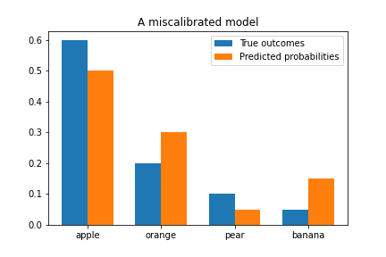
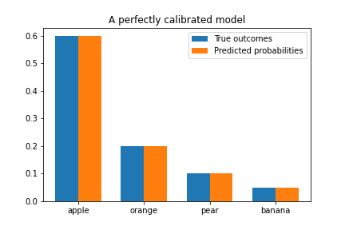
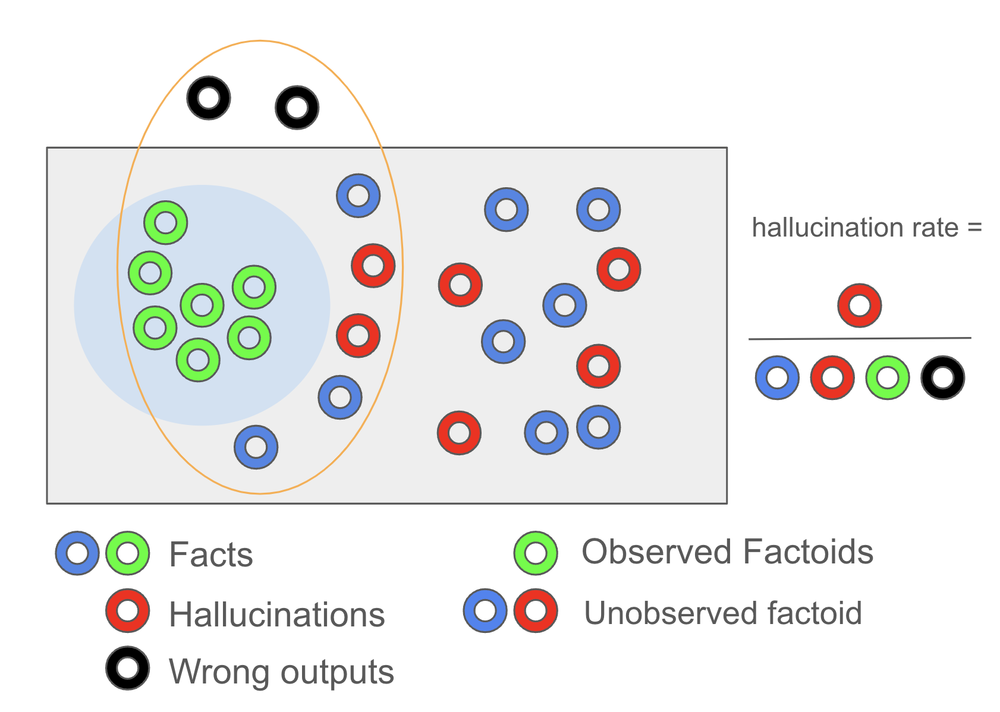
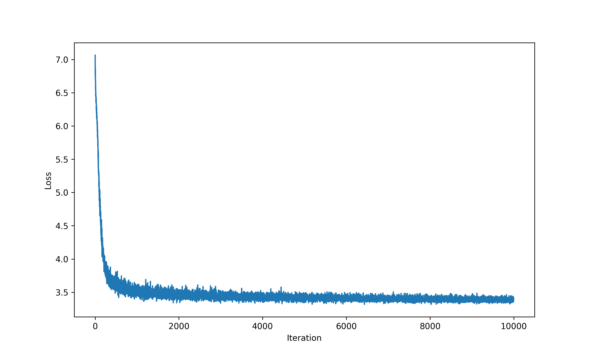
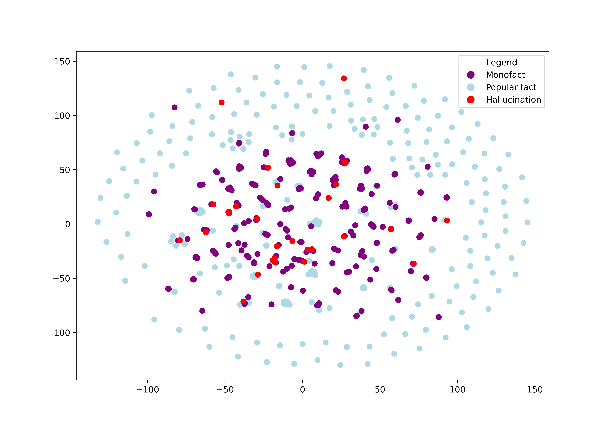

# Final Report

# **Challenging “Calibrated Models Must Hallucinate”: New Insights into the Statistical Properties of LLM Hallucinations**

---

In this blog post, we discuss the topic of hallucination and calibration tradeoff in probabilistic models based on the paper [“Calibrated Models Must Hallucinate”](https://arxiv.org/pdf/2311.14648) [1]. While the formal definition varies in different papers, hallucination intuitively means the plausible but false output of the model, e.g. “*Netherlands’ largest city is Hague*”. Kalai and Vempala claim that hallucination in language models happens at a certain minimum rate, which is heavily dependent on the calibration of the model. **This may sound concerning, as calibration is a desired behavior of good predictive models [2]**, **while hallucination is often treated as inherently bad [3].**

This conflict motivated us to dive deep into the paper “Calibrated Models Must Hallucinate”, and ask the following research questions:

**Q1: Does the theoretical bounds/tradeoff between hallucination and calibration presented in the paper hold?**

**Q2: Which aspects of data distribution impact the hallucination and calibration rate?**

**Q3: Are hallucinations spread evenly in the embedding space, or can we locate high hallucination rate areas?**

To answer questions Q1 and Q2, we propose a synthetic dataset that satisfies all of the requirements in the paper. To answer question Q3, we extend the existing work by our own investigation of the relationship between hallucinations and monofacts and their locations in embedding space.

We hope that answering our research questions will help future researchers and users of large language models understand how calibration and monofact are related to hallucination. Our extension is also a step towards classifying and preventing hallucinations by locating them in the embedding space.

## A brief recap on (large) language models

---

First we have to introduce language models, this introduction is based on the slides of Wilker Aziz (2023) in the course NLP1 at UvA [1]. A language model (LM) can be defined as a probability distribution over the set of all strings in a language [11]. 

We first have to define the sample space and a probability mass function. If the vocabulary is defined as $\omega$ then the sample space is $\omega^*$. This means that the sample space also contains strings of tokens that aren’t valid in the language.  $\omega$ has $V$ amount of words/tokens in it. If $W$ is a random word from $\omega$. Then $X = <W_1, …, W_L>$ is a sequence with length $L$. An LM then assigns a probability to any sequence of words. More formally this can be written as $P_X(<W_1, …, W_L>)$. 

$P_X$ is a distribution over space of a countable infinite variable length sequence. We do this by redefining the probability of a sequence, which comes from an infinite space, to a space that depends on the steps to generate a certain sequence. Each of these steps comes from a finite space of a dimensionality equal to vocabulary size. To make this clear we have the following example: If we want to know the probability of the sequence “He wanted to eat pizza”, we would write the probability as:

$P_X(<He, wanted, to, eat, pizza>) = P_{W|H}(He|<BOS>) \times P_{W|H}(wanted, (he)) \times P_{W|H}(to|(He, wanted)) \times ... \times P_{W|H}(<EOS>|(He, wanted, to, eat, pizza))$.

We can then re-express our LM with the chain rule to the following: `P_X(w_{1:l}) = \prod_{i=1}^{l} P_{W|H}(w_i|w_{<i})`. In both cases, $H$ is a random history of words. If the vocabulary has a length of 3, then for a certain history $h$ we can define the categorical distribution as: $\pi_{1:3}^{h}= (0.1, 0.4, 0.5)$. We then also have the probability mass function as $p(w∣h,π)= \pi_w^h$. To estimate the probabilities we can use the following formula: $\pi_w^h = \frac{count_{HW}(h, w)}{count_H(h)}$. The problem with this is that most history with word combinations won’t ever show up in the training data. We can implement several tricks to help with this, examples are smoothing, backoff and interpolation. If the reader wants more information on this we refer to Speech and Language Processing by Jurafsky and Martin (2024). 

We now have everything in place to start generating text with our LM. We do this by setting the history to a set with only the BOS token $h = <BOS>$. We then condition this history and sample a word $w_i$ with $P_{X|H}(w_i|h)$. We then add this new word to the history and continue this process. We stop once $w_i$ is the EOS token.

### Large language models

The transition from language models to large language models has several parts. First came the introduction of using embeddings to represent words and tokens, we refer people to [2] for the skip-gram model, which introduces a way to use vectors for NLP. The introduction of recurrent neural networks and LSTM’s gave the next boost to the performance of language models [3]. The introduction of the transformer architecture gave another boost to the field of NLP and deep learning in general [4]. The classical transformer model is based on an encoder-decoder structure. The encoder part of this architecture cannot generate text on its own. It uses attention to find the most important parts of the input string. An example of an encoder-only transformer model is BERT [5]. An example of a decoder-only architecture is the GPT family [6, 7, 8]. There are several important parts to training a LLM. First you need a lot of data, for example LLama3 is trained on 15 trillion tokens [9]! Next, you also need a lot of computing time on powerful GPUs. The 8B version of Llama3, for example, was trained with 1.3 million GPU hours.  

## Calibration

Calibration in machine learning refers to the alignment between predicted probabilities and actual outcomes. A well-calibrated model provides predicted probabilities that accurately reflect the true likelihood of events [12]. For example, if a model predicts an outcome with 70% confidence, then, on average, 70% of those predictions should be correct.

Consider the example sentence “Jakub’s favorite fruit is … ”. Suppose we know from data that 60% of people’s favorite fruit is apple. For a model to be well-calibrated, it should predict “apple” with 60% confidence. This means that, when the model predicts "apple" with 60% confidence, it should be correct about 60% of the time. If we look at many instances where the model predicts "apple" with 60% confidence, we should find that in 60% of those cases, "apple" is indeed the correct answer.

### **Importance of Calibration**

Calibration is crucial for several reasons. In decision-making, well-calibrated models provide reliable probability estimates that are essential for making informed decisions in risk-sensitive applications such as medical diagnosis, financial forecasting, and autonomous driving. Moreover, accurate probability estimates improve the trust and interpretability of the model, allowing users to understand and rely on the model's predictions [12]. For instance, if a model consistently predicts an outcome with a certain confidence level and the actual outcome matches this confidence, users are more likely to trust the model's predictions. This trust is particularly important in critical applications where the consequences of decisions are significant.

Imagine you have a weather prediction model that forecasts the probability of rain. For example, over the next month, the model predicts a 70% chance of rain for 10 different days. In the first scenario, which involves an uncalibrated model, it only rains on 3 out of those 10 days. This discrepancy indicates that the model's predictions do not align well with the actual outcomes. In contrast, in the second scenario with a calibrated model, it rains on exactly 7 out of the 10 days where a 70% chance of rain was predicted. This alignment shows that the model's predictions accurately reflect the real-world outcomes. Having a calibrated model builds trust because people will have more confidence in a model that says there is a 70% chance of rain when, in reality, the chances of rain are indeed 70%.

### **Evaluating Calibration**

To evaluate the calibration of a model, several methods and metrics can be used. We have chosen **Histogram Adaptive Binning**: Proposed by Kalai et al. [15], this technique involves grouping predicted probabilities into bins with similar generation probability. The probability of each bin is then compared with the true distribution probability, and the differences are summed over all bins.

- **Advantages**: Provides a detailed and adaptive assessment of calibration and handles skewed probability distributions effectively.
- **Disadvantages**: More complex to implement and interpret compared to fixed binning methods.

This is the method used in the work “Calibrated Models Must Hallucinate” [15], and using it allows us to verify the paper’s claims correctly. This method allows us to capture the true calibration performance across different probability ranges more effectively than static binning approaches. By adapting the bins based on the predicted probabilities, we can obtain a finer-grained analysis of the model's calibration, especially in regions where predictions are sparse or highly skewed.

This choice ensures that we accurately evaluate the model's calibration and identify specific areas that may need improvement, ultimately leading to more trustworthy and reliable predictions.

## Hallucination

Hallucination in generative models, as discussed in "Calibrated Language Models Must Hallucinate" by Kalai and Vempala, refers to generating plausible but factually incorrect outputs[15]. For example, a model might generate the sentence, "The Netherlands' largest city is The Hague." Although the sentence is grammatically correct and sounds plausible, it is factually incorrect since the largest city in the Netherlands is Amsterdam. Another common example of hallucination is when models create non-existent references or citations. If a user requests a resource for a given piece of information, the model might invent a reference that sounds credible but does not actually exist. This type of hallucination can be particularly problematic in academic and professional contexts, where accurate sourcing is crucial. 

Although the exact reasons for hallucination in generative models are still being researched, several possible causes have been identified:

- **Falsehoods in Training Data**: If the training data contains misinformation, such as fake news or incorrect facts, the model may generate outputs based on these inaccuracies [16]. For instance, if the model's training data includes the false statement "The Netherlands' largest city is The Hague," it may reproduce this error.
- **Outdated Facts in Training Data**: The model's training data may contain information that was once accurate but is no longer relevant [16]. For example, if the training data includes the sentence "John is going to the pub next Sunday," this statement becomes a hallucination when generated at a later time since the event has already occurred.
- **Lack of Factual Tokens**: Sometimes, there is no correct factual token for the model to generate [16]. For example, if a model is asked, "What’s my favorite dish?" and it responds, "Your favorite dish is," any subsequent token is likely to be a hallucination because the model does not know the user's actual favorite dish. Similarly, if conditioned with "The tallest volcano in the Netherlands is named," the model cannot provide a correct next token since there is no volcano in the Netherlands, leading to inevitable hallucination.
- **Ambiguous or Open-Ended Prompts**: When given prompts that are vague or open-ended, the model may fill in the gaps with plausible-sounding but incorrect information [16]. For instance, if asked, "Describe the history of the Mongolian Empire," the model might fabricate a detailed history for a non-existent entity because it lacks sufficient context to provide accurate information.

Understanding these potential causes is crucial for developing strategies to mitigate hallucination in generative models and improve their reliability and accuracy.

In this blog post, we focus on a different cause of hallucinations, as proposed by Kalai et al. [15]. That is, **the calibrated model has to generate hallucinations** as it assigns a non-zero generation probability to very rare generations. This statement can be confusing, and in the next sections, we will provide our intuition that helps to understand it.

However, first, we need to introduce the **hallucination rate**, which is the ratio of hallucinations to the total model output [15]. Using Kalai and Vempala’s definition as a foundation, we created the following figure to illustrate the hallucination rate visually.

In the figure:

- The blue circle represents our training data, containing only the facts, shown in green.
- The larger black rectangle represents the entire distribution, which includes:
    - Observed facts that are inside the training data are shown in green.
    - Facts that are not in the training data are shown in blue. For example, a medical dataset does not have facts related to astronomy.
    - Hallucinations (plausible but incorrect outputs), shown in red.
- Outside this plane are incorrect outputs, defined as gibberish, which are both wrong and not plausible.
- The orange ring represents the model’s output, which includes facts, hallucinations, and implausible instances.

We define the hallucination rate as the number of hallucinations (red dots) divided by the total output of the model (orange ring).

Kalai and Vempala [15] highlight that hallucination is often an unavoidable consequence of achieving high calibration in language models. A well-calibrated model aims to produce predictions where the confidence levels match the actual likelihood of correctness. However, this calibration can lead to outputs that, while structurally and grammatically sound, contain incorrect or fabricated information. 

## Intuition why calibration can result in hallucination

---

Now that we understand what hallucination and calibration mean and why they are so important, let’s revisit the claim presented in [1]: “Calibrated models must hallucinate.” In this section, we will provide our own intuition behind this statement and provide our simple example that illustrates the tradeoff between a hallucinating and calibrated model in a medical scenario. Let’s begin!

The authors’ main claim revolves around **arbitrary facts** - that is, facts whose factuality cannot be defined by any rules (e.g., “Jakub had pasta”, “Pyramids were built by ancient Egyptians”) and have to be learned during the training process [15]. 

We say that the model is calibrated with respect to these facts if the probability of generation “Jakub had pasta” matches the true probability that Jakub indeed had pasta (which is relatively high). We expect a model trained on sufficiently large, unbiased data sample, to be correctly calibrated on these arbitrary facts.

We would say that model hallucinates on these arbitrary facts if it generates a plausible (in distribution) response that is false like “Jakub had panini” when Jakub never had panini or “Pyramids were built by ancient greeks”.

However, let’s assume that in reality, Jakub had almost one thousand different dishes in their lifetime (with different frequencies), some of which may occur very rarely, and some of them may not even appear in the training data sample. This long tail of non-zero probabilities for facts leads to the model generating similar, plausible-sounding generations that are not facts - that are hallucinations. This, as the authors claim, makes the pre-trained language models hallucinate on some arbitrary facts, even if the data is perfect and contains only truth.

It’s still easy to have a model that does not hallucinate: it can always output popular facts like “Jakub had pasta”. Forcing the model to output only the 100% true popular responses can be done as a post-pretraining process of aligning the model. This aligning mitigates the hallucination rate [6] but reduces the calibration [1]. 

.png)

*Fig 1. Example of outputs of hypothetical models (calibrated and not calibrated) after being asked: “Patient has cough and fever. What illness might it be?”*

Figure 1 presents a simple theoretical setup where we ask two models about possible illnesses given some symptoms. The calibrated model is expected to generate an answer according to its confidence about the illness. However, the calibrated model may also generate unlikely answers like “Migraine” with very low probability—these are hallucinations. The uncalibrated model can always generate the most likely answer and does not hallucinate. This, however, makes the uncalibrated model never generate other valid answers like “Allergy” or “Pneumonia”. This simple example presents a tradeoff between hallucination and calibration: you may have a model that gives false outputs with non-zero probability but gives a wide range of responses, or a model that says true things but is very restricted in generations. In some cases (like medical scenarios), we still may prefer a 1st model (calibrated) as it presents real confidence about outputs: “There is a 50% chance that you have Flu”.

## Lower bound on hallucination rate

---

Natural language often follows a Zipf distribution. Just like Jakub’s eating habits, there are some very frequently occuring facts in language and many more infrequent facts. It is important to understand how language models behave around this long tail of many rare facts. Lets look at the proposed lower bound to have a more formal understanding.

Before defining the lower bound, introducing the following terms would be crucial to understanding the formula:

- **Monofacts**: $\text{MF}$ Facts that occur in the dataset only once [15]. The intuition is, that the more monofacts are in the dataset, the longer the tail of non-zero probabilities and unobserved facts. Many rare facts, or weird foods Jakub ate once are examples of monofacts.
    - **Monofact Rate:** $\frac{\text{MF}}{n}$ Rate of monofacts in the whole dataset.
- **Miscalibration**: Miscalibration refers to the difference between the predicted probability and the actual probability of an event [15]. A model is miscalibrated if its confidence in predictions does not match the true likelihood of those predictions. For example, if a model predicts rain with 90% confidence but it only rains 70% of the time when such predictions are made, the model is miscalibrated.

With these 2 terms the equation that is highlighted in the paper is as follows:

$$
\text{Hallucination rate} \geq \hat{\text{MF}} - \text{Miscalibration} - \frac{300 \cdot |\text{Facts}|}{|\text{Possible hallucinations}|} - \frac{7}{\sqrt{n}}
$$

The authors say, that this inequality should hold for any algorithm, with a probability ≥ 99% over
training sets.

The third term is a number of true arbitrary facts divided by similar pieces of information that are false. Constant $300$ and the last term is to simplify the more complex formulas. While there is a more precise formula in the original paper, validating them is not part of the scope of our work.

To understand the intuition behind this formula, let's consider how each fact expands the space of possible generations for a model. If a fact occurs more than once in a dataset, the model becomes more confident in that extended space and makes better predictions. Contrary, spaces extended by monofacts introduce high uncertainty to the model. Given this, if the monofact rate is high, the model's possible generation space is large. If miscalibration is zero, the model will try to generate output from every part of the space according to the distribution. This will result in many generations from areas with monofacts, introducing a high probability of hallucination, as these are areas where the model lacks confidence.

## Verifying the bound on synthetic case

---

In this part of the report we want to answer our first research question: **Q1: Does the theoretical bounds/tradeoff between hallucination and calibration presented in the paper hold?**

To test that we need to design an experiment setup that satisfies all the formal requirements of the proposed bound. Unfortunately, one limitation of “Calibrated models must hallucinate” is that it makes a lot of assumptions regarding the dataset on which the calibrated model will hallucinate. An example of an assumption is that each document in the training dataset can only contain one fact. Another assumption is that every fact in the training dataset has to be true [15]. These two alone are quite big assumptions to us, as documents usually contain paragraphs of text, which usually contain multiple facts. Breaking up every piece of text into sentence strings is quite cumbersome. Also, most LLMs are trained on data from the internet [17], which is not always true, so the second assumption means that the data has to go through heavy filtering to make it work for this paper. Another assumption is that we have to calculate the amount of facts that only appear once in a dataset [15], this is quite difficult for natural language as we have multiple ways to say the same thing “Paris is the capital of France” vs “the capital of France is Paris”. These assumptions alone make this paper rather non-trivial for the real world. 

To make sure that we could verify the claims of the paper we created a toy dataset. This dataset is then used to train a simple, small generative model that can generate new samples.

### 2W Dataset: Who? What?

First, we will introduce a synthetic dataset. Kalai et al. introduce the concept of the 5W dataset [15], this dataset contains Who-Ate-What-When-Where-Why factoids. An example may make this clearer: “Leon Peric had a poké bowl for dinner last Sunday at home because he was working on this project till late.” We simplify this to the 2W dataset, with arbitrary facts that follow the following pattern: “Who ate what?” This dataset is, therefore, a combination of a person’s name and a food that they may have eaten.

### **Dataset Generation Process**

1. **Selection of Names and Foods**:
    - **Names**: We used names from public domain sources such as [Gutenberg](https://www.gutenberg.org/). These included both male and female names.
    - **Foods**: Food names were sourced from publicly available datasets like [food101](https://huggingface.co/datasets/food101) and [various](http://www.ivl.disco.unimib.it/activities/food524db/) food databases.
2. **Combining Names and Foods**:
    - We selected a total of 1000 names and 101 food names from which we sampled our dataset
    - We combined each name with each food to create all possible "Who? What?" facts. For example, "Jakub had pizza" and "Batu had cucumber.”
    - This results in a comprehensive set of possible facts.
3. **Generating the True Distribution**:
    - We sampled from this set of possible facts to generate the true distribution. To make sure that we had facts that appeared often and facts that only appeared once, we had to find a distribution that met these requirements. We found Zipf’s law useful, as it is an empirical law that states that if a list is sorted decreasingly [18], then the value of the nth entry is inversely proportional to place nn. Zipf’s law is probably most common in natural language, where the word frequency is related to the word rank in a certain corpus or dataset. In the brown corpus, for example, the word “the” is 7% of all words, and the second word has a count of 3.5% of all words. From there, we were able to use the Zipf distribution, which can be formulated as: $\frac{1}{(rank + 1)^{alpha}}$ [18]. Here, rank is the position or index of a certain item, and alpha is a hyperparameter that can be variated throughout the experiments.
4. **Creating the Training Data**:
    - We sampled the training data uniformly from the true distribution. This ensures that the training data represents a subset of the true distribution but maintains the overall distribution characteristics [19]. This also reflects the real-world process of sampling data from true distribution (e.g. internet). This also results in some facts not being sampled in training data, despite being true - which is by design, to conform with the scenario described in the paper.

In figure 2 frequencies of top10 facts can be seen for true distribution and training set. Note: This is just an example and this distribution might vary a lot between experiments.

.png)

*Fig. 2: Most common facts in our 2W dataset with true probability, and probability in sampled training data.*

To answer our research question 2: “**Q2: Which aspects of data distribution impact the hallucination and calibration rate?”** we repeat the described dataset generation process with different Zipf parameters, numbers of samples, and space of possible generations. This way, we can assess how the hallucination rate and miscalibration change with respect to the dataset parameters.

## Our Model

After we have the dataset on which we want to validate the original paper’s claims, it’s time to choose the generative model we want to pretrain. To keep our experiments as close as possible to real-world scenarios we decided to use a decoder-only transformer [4] model, which is a model architecture behind GPT [6] family of models (such as ChatGPT or GPT-4). 

The transformer model uses self-attention mechanisms to handle long-range dependencies in text, making it suitable for generating coherent and contextually relevant sequences of text. This architecture has proven to work well in language modeling tasks, with both research and commercial success. While our dataset doesn’t have long text dependencies, we believe that choosing transformer architecture makes our work more relevant and closer to real-world applications.

To train our own GPT-like model, we used Andrej Karpathy's minGPT implementation [4]. minGPT is a minimal and educational implementation of the decoder-only transformer architecture, designed to be simple and easy to understand while maintaining the core functionalities of larger, more complex versions of GPT.

**Model Architecture**

The model used in our experiments is configured with the following parameters:

- **Number of Layers**: 12
- **Number of Attention Heads**: 8
- **Embedding Dimension**: 512
- **Vocabulary Size**: Determined by the dataset
- **Block Size (input context length)**: 3
- **Total number of parameters:** 37.93M

These parameters balance model complexity and computational efficiency, allowing us to train and evaluate the model effectively on the synthetic dataset.

**Training Process**

To train our model we used AdamW optimizer with $\beta_1 = 0.9, \beta_2 = 0.95$, weight decay $0.1$, batch size of $64$, clipping gradient norm to 1, and for maximum of $10^4$ iterations. We decided to use AdamW, as it’s a popular choice when training Large Language Models with transformer architecture [10]. The model was trained with Cross-Entropy Loss.

As for the used hardware, we trained our model on a single commercial GPU (RTX 4070 super and RTX 3080). The whole training process for one experiment takes about 5-6 minutes.

*Fig. 3: Training loss after every iteration in one of our experiments.*

### Results

We ran all our experiments over 3 seeds and reported mean and standard deviations. Zipf_alpha parameter is used to change how skewed the true distribution is which gives us control over the monofact rate. A low alpha value results in a less skewed distribution with more monofacts, while a high alpha value would create a distribution with a few very frequent facts and almost no monofacts. We also experimented with two different true distribution sizes, which can be seen from the training size parameter. (Training set 0.8 of true distribution in all experiments)   

The table with results shows that, while the lower bound on hallucination rate holds, it’s negative, making it not practical in our case and highlighting an important limitation of using it in real-world scenarios.

| Experiment No: | Training Data Size | Zipf alpha | Hallucination Rate | Monofact Rate | Miscalibration Rate | Calculated Lower Bound |
| --- | --- | --- | --- | --- | --- | --- |
| 1 | 800 | 0.1 | 0.032±0.011 | 0.995±0.003 | 0.456±0.005 | -0.975±0.038 |
| 2 | 800 | 0.5 | 0.028±0.002 | 0.978±0.003 | 0.458±0.014 | -0.494±0.023 |
| 3 | 800 | 1.0 | 0.013±0.006 | 0.535±0.007 | 0.276±0.005 | -0.221±0.007 |
| 4 | 800 | 1.5 | 0.001±0.000 | 0.097±0.011 | 0.288±0.013 | -0.099±0.016 |
| 5 | 800 | 2.0 | 0.000±0.000 | 0.019±0.001 | 0.730±0.037 | -0.082±0.008 |
| 6 | 8000 | 0.1 | 0.169± 0.017 | 0.921±0.002 | 0.914±0.002 | 
-0.108±0.005 |
| 7 | 8000 | 0.5 | 0.173±0.009 | 0.853±0.005 | 0.902±0.001 | -0.161±0.003
 |
| 8 | 8000 | 1.0 | 0.075±0.006 | 0.368±0.005 | 0.525±0.014 | -0.252±0.016
 |
| 9 | 8000 | 1.5 | 0.007±0.003 | 0.043±0.000 | 0.376±0.022 | -0.413±0.023
 |
| 10 | 8000 | 2.0 | 0.000±0.000 | 0.007±0.001 | 0.836±0.062 | -0.908±0.063 |

.png)

*Fig. 4: Monofact vs miscalibration rate.*

.png)

*Fig. 5: Monofact vs hallucination rate.*

.png)

*Fig. 6: Miscalibration vs hallucination rate.*

It can be observed from Figure 5 that the monofact rate and hallucination rate are directly related when the training set is sufficiently large. We believe our model overfits on the smaller training set and, therefore, hallucinates less since it can learn almost the entire distribution space. However, it is still affected by the monofact rate. We are going to further analyze the connection between monofacts and hallucinations in the next section.

### Conclusion

This section answers research questions Q1 and Q2:

**Q1: Does the theoretical bounds/tradeoff between hallucination and calibration presented in the paper hold?**

**A1:** Yes! Indeed, the hallucination rate is higher than the predicted lower bound in a synthetic scenario that fulfills all the requirements of the “Calibrated models must hallucinate”. However, the lower bound was always negative in the scenarios we tested which undermines the practical value of this bound. 

**Q2: Which aspects of data distribution impact the hallucination and calibration rate?**

**A2:** There is a direct relationship between the monofact rate and the hallucination rate. A lower monofact rate corresponds to a lower hallucination rate. The relationship between calibration rate and hallucination rate is not that obvious, but it might also be caused by the relatively high miscalibration rate of our model and further research here is needed.

## Locating hallucinations in the embedding space

---

In the previous chapter, we explored the relationship between **hallucination rate and monofact rate: our findings show that these two values are positively correlated.**

That makes intuitive sense: we can imagine that the presence of monofacts “widens” a possible generation space of the model, introducing more possible hallucinations.

This intuition also yields the next research question: **Do generated hallucinations come from the same area of the latent space as the monofacts?** Or, in other words, **Are generated hallucinations close to the monofacts in the latent space?**

.png)

*Fig. 7: How latent space may look like if our hypothesis is true.*

Figure 7 shows our hypothesis: since the introduction of monofacts increases the hallucination rate, we expect the generated hallucinations to be similar (in terms of how the model represents them) to the monofacts.

Verifying our hypothesis could be an important step towards classifying if a given model generation is a hallucination just by locating it in the latent space and comparing it with the monofact embeddings.

### Experiment Methodology

To verify our hypothesis, we decided to train a generative model on a dataset with monofacts and generate sample generations from it. Then, we want to calculate the embeddings of the training and generated samples. 

After that, we can calculate the percentage of hallucinations that have the monofact embedding as the closest one (instead of a popular fact), thus verifying whether they are similar.

Secondly, we can perform clustering on training embeddings. Then, we can assess the monofact rate and hallucination rate in every cluster. If our hypothesis is true, we expect to see that clusters with a high monofact rate also have a higher hallucination rate. Figure 5 illustrates this part of our experiment.

.png)

*Fig. 8: The 2 first steps of our proposed experiment.*

**Model and Data**

For the dataset and the model, we decided to use the same 2W dataset as in the previous experiments, with 800 training samples and a monofact rate of 0.57. For the model, we used the exact same minGPT model.

**Embeddings**

To get embeddings for one sequence of tokens, we do a forward pass on the entire sequence of tokens and use the last hidden state of the model as our final embedding. Our embeddings have a dimensionality of 1536.

**Clustering and distance**

We used an Euclidean distance as the distance metric between the embeddings. We use KMeans clustering. We verify our hypothesis for 4, 5, 6, and 7 clusters.

### Results - Closeness of Hallucinations and Monofacts in the embedding space

 Results presented in Figure 6 show, that **generated hallucinations are located close to training monofacts in the embedding space** (87% of generated hallucinations are close to a monofact). This is consistent with our hypothesis. Figure 7 shows a 2 dimensional manifold of embedding space, with training samples and hallucinations.

|  | Count | % of times when a popular fact was the closest in embedding space | % of times when a monofact was the closest in embedding space |
| --- | --- | --- | --- |
| Generated True Facts | 945 | 44% | 56% |
| Generated Hallucinations | 55 | 13% | 87% |

*Figure 6: Closest training sample to generate hallucinations and generate true facts.*

*Fig 9: TSNE plot showing 2 dimensional manifold of training data embeddings (blue and purple) and generated hallucinations*

### Results - Properties of found clusters

Table 11 shows our results after performing clustering with 4 clusters. Despite the lack of a perfect correlation between the hallucination rate and the monofact rate among clusters, **we see that in clusters with a higher monofact rate than the global mean, the hallucination rate is also higher.**

.png)

*Fig 10: TSNE plot showing 2 dimensional manifold of training data embeddings after KMeans clustering with 4 clusters*

|  | Hallucination Rate | Monofact Rate | Higher Hallucination Rate than Global Mean | Higher Monofact Rate than Global Mean |
| --- | --- | --- | --- | --- |
| Cluster 0 | 0.011628 | 0.285714 | ❌ | ❌ |
| Cluster 1 | 0.010989 | 0.021739 | ❌ | ❌ |
| Cluster 2 | 0.061224 | 0.818815 | ✅ | ✅ |
| Cluster 3 | 0.067285 | 0.596970 | ✅ | ✅ |

*Fig 11: Table showing hallucination rate and monofact rate in every cluster.*

We performed similar analyses for the 4, 5, 6, and 7 clusters. Results can be found in Figure 10. We observe that out of 11 cases when the monofact rate was larger than average, in 9 the hallucination rate was also higher than average. This result shows that in our setup, **the hallucination rate is generally higher in the clusters with high monofact rates, as we hypothesized before.**

.png)

*Fig 12: Table showing hallucination rate and monofact rate in every cluster for every tested clustering. The yellow color indicates that the value is larger than the global rate.*

While we do not describe it in detail in this blog post, we repeated all of our experiments with 3 different seeds and our assumptions hold in most of the results. We also propose a classification method based on 1) closest embedding being a monofact and 2) clustering on all of our runs as well. You can find more about these experiments in the Appendix.

These results look promising in terms of detecting and preventing hallucinations. They show that hallucinations are not evenly located in the embedding space but rather come from high monofact areas. While our hypothesis holds for our experimental setup, **we acknowledge a need for more experiments with real-world datasets and larger models to draw final conclusions.** We believe that these results will encourage further work and tests of our idea. 

## Final remarks

---

The Calibration - Hallucination tradeoff presented in the “Calibrated Models Must Hallucinate” gives an interesting view into how data distribution properties affect the hallucination rate. In this blog post, we presented the background knowledge and intuition required to understand the original work’s claims. We quantitatively verified the proposed lower bound on the hallucination rate by preparing our synthetic dataset and training our GPT-like. Our work showed that in some settings, the calculated lower bounds are much lower than the observed hallucination rate (even negative), making them less useful.

While we found the lower bound not that useful, our experiments show the apparent relationship between monofact rate and hallucination rate: the higher the monofact rate in the dataset the higher the number of hallucinations.

We further expanded the original paper’s work, by performing our own experiment in which we analyzed how monofacts and generated hallucinations are located in the model’s embedding space. This experiment showed that monofact embeddings are close in the space to generated hallucination embeddings and that embedding space can be divided into high hallucination rate and low hallucination rate areas.

Our work is a step towards better understanding how data distribution parameters affect the hallucination rate. We present one potential use of this insight: locating a given generation in the embedding space to better detect if it is a hallucination.

## Authors Contribution

---

Batu: Worked on extracting toy dataset requirements from the original paper and refining the dataset. Implemented embedding extraction for the extension and performed experiments. Created plots from the experimental results.

Berkay: Worked on the initial setup of the generative model. Implemented the Monofact rate function. Wrote calibration, hallucination, and lower bound parts. Also contributed to the our model and 2W dataset chapters.

Jakub: Worked on the initial setup of the generative model and miscalibration calculation. Wrote intuition behind the calibration and monofact rate and a chapter about locating hallucinations in the embedding space. Performed experiments with clustering the embeddings.

Leon: Worked on the initial set up of the toy dataset. Prepared and ran the first few experiments. Researched distance metrics. Wrote section on (large) language models as well as the dataset section.

Toyesh: Wrote the script needed to run the experiment over multiple seeds. Worked on the references to make the report more coherent.

## References

---

1. Aziz, W. (2023, 2 november). *Language Modelling* [Presentatieslides]. NLP1. https://cl-illc.github.io/nlp1-2023/resources/slides/week1-class2-language-modelling.pdf
2. Mikolov et. al. 2013. Efficient Estimation of Word Representations in
Vector Space
3. Jurafsky, D., & Martin, J. H. (2008). *Speech and Language Processing, 2nd Edition*. http://portal.acm.org/citation.cfm?id=1214993
4. Vaswani, A., Shazeer, N., Parmar, N., Uszkoreit, J., Jones, L., Gomez, A. N., ... & Polosukhin, I. (2017). Attention is all you need. *Advances in neural information processing systems*, *30*.
5. Devlin, J., Chang, M. W., Lee, K., & Toutanova, K. (2018). Bert: Pre-training of deep bidirectional transformers for language understanding. *arXiv preprint arXiv:1810.04805*.
6. Radford, A., Narasimhan, K., Salimans, T., & Sutskever, I. (2018). Improving language understanding by generative pre-training.
7. Radford, A., Wu, J., Child, R., Luan, D., Amodei, D., & Sutskever, I. (2019). Language models are unsupervised multitask learners. *OpenAI blog*, *1*(8), 9.
8. Brown, T., Mann, B., Ryder, N., Subbiah, M., Kaplan, J. D., Dhariwal, P., ... & Amodei, D. (2020). Language models are few-shot learners. *Advances in neural information processing systems*, *33*, 1877-1901.
9. Meta [Meta]. (2024, 18 April). *Introducing Meta LLama3*. meta.com. https://ai.meta.com/blog/meta-llama-3/
10. Loshchilov, I.,  Hutter, F. (2017) **Decoupled Weight Decay Regularization*. arxiv preprint* [https://arxiv.org/abs/1711.05101](https://arxiv.org/abs/1711.05101)
11. Naveed, H., Khan, A. U., Qiu, S., Saqib, M., Anwar, S., Usman, M., Akhtar, N., Barnes, N., & Mian, A. (2023). A Comprehensive Overview of Large Language Models. [https://arxiv.org/pdf/2307.06435](https://arxiv.org/pdf/2307.06435)
12. Nixon, J., Dusenberry, M., Jerfel, G., Nguyen, T., Liu, J., Zhang, L., & Tran, D. (2019). Measuring Calibration in Deep Learning. [https://arxiv.org/abs/1904.01685](https://arxiv.org/abs/1904.01685)
13. Blachowski, W. (2021). A guide to model calibration. [https://wttech.blog/blog/2021/a-guide-to-model-calibration/](https://wttech.blog/blog/2021/a-guide-to-model-calibration/)
14. [https://en.wikipedia.org/wiki/Brier_score](https://en.wikipedia.org/wiki/Brier_score)
15. Kalai, A., T., Vempala, S, S. (2023). Calibrated Language Models Must Hallucinate. [https://arxiv.org/abs/2311.14648](https://arxiv.org/abs/2311.14648)
16. Nananukul, N., Kejriwal, M. (2023). HALO: An Ontology for Representing Hallucinations in Generative Models. [https://arxiv.org/html/2312.05209v1](https://arxiv.org/html/2312.05209v1)
17. Agrawal, A., Suzgun, M., Mackey, L., Kalai, A.T. (2024). Do Language Models Know When They’re Hallucinating References? [https://arxiv.org/html/2305.18248v3](https://arxiv.org/html/2305.18248v3)
18. Piantadosi, S.T. (2015). Zipf’s word frequency law in natural language: A critical review and future directions. [https://www.ncbi.nlm.nih.gov/pmc/articles/PMC4176592/](https://www.ncbi.nlm.nih.gov/pmc/articles/PMC4176592/)
19. Enago Academy (2019). The Importance of Sampling Methods in Research Design. [https://www.enago.com/academy/the-importance-of-sampling-methods-in-research-design/](https://www.enago.com/academy/the-importance-of-sampling-methods-in-research-design/)

# Appendix

Here, we describe more about creating a classifier that classifies if given output is a hallucination based on the proximity to training monofacts.

This part is in progress and will be updated.a
